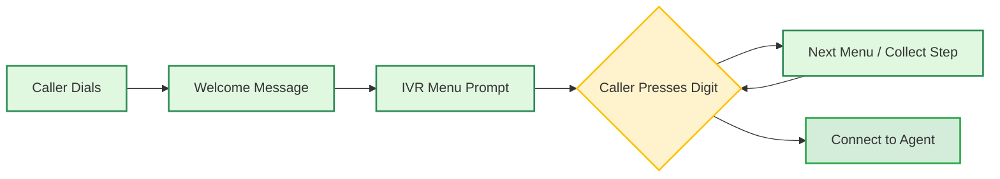

> ## Documentation Index
> Fetch the complete documentation index at: https://www.bolna.ai/docs/llms.txt
> Use this file to discover all available pages before exploring further.

# Set Up IVR for Inbound Calls in Bolna Voice AI

> Configure IVR menus to route inbound calls to different Bolna Voice AI agents. Support department routing, language selection, and data collection.

## What is IVR?

IVR (Interactive Voice Response) lets callers navigate menus using their phone keypad before connecting to a Voice AI agent.

<CardGroup cols={3}>
  <Card title="Route by Department" icon="sitemap">
    Send callers to Sales, Support, or Billing agents automatically
  </Card>

  <Card title="Collect Information" icon="keyboard">
    Gather account numbers, PINs, or preferences before the conversation
  </Card>

  <Card title="Multi-Language Support" icon="language">
    Let callers choose their preferred language before connecting
  </Card>
</CardGroup>

<Warning>
  IVR is currently supported for **Plivo** phone numbers only.
</Warning>

***

## How IVR Works



All collected data (department choice, account number, etc.) is passed to the agent as context.

***

## Setting Up IVR via API

Add `ivr_config` to the [Set Inbound Agent API](/docs/api-reference/inbound/agent):

<CodeGroup>
  ```bash request theme={"system"}
  curl -X POST "https://api.bolna.ai/inbound/setup" \
    -H "Authorization: Bearer <token>" \
    -H "Content-Type: application/json" \
    -d '{
      "agent_id": "your-default-agent-id",
      "phone_number_id": "your-phone-number-id",
      "ivr_config": {
        "enabled": true,
        "voice": "Polly.Aditi",
        "welcome_message": "Welcome to Acme Corp.",
        "steps": [
          {
            "step_id": "main_menu",
            "type": "menu",
            "prompt": "Press 1 for Sales. Press 2 for Support.",
            "field_name": "department",
            "options": [
              {"digit": "1", "label": "Sales", "agent_id": "sales-agent-id"},
              {"digit": "2", "label": "Support", "agent_id": "support-agent-id"}
            ]
          }
        ]
      }
    }'
  ```

  ```json response theme={"system"}
  {
    "message": "Phone number is already mapped to the given agent. IVR config updated."
  }
  ```
</CodeGroup>

***

## IVR Configuration Reference

### Top-Level Config

| Field                   | Type    | Default                            | Description                                      |
| ----------------------- | ------- | ---------------------------------- | ------------------------------------------------ |
| `enabled`               | boolean | `false`                            | Enable or disable IVR                            |
| `voice`                 | string  | `Polly.Joanna`                     | Text-to-speech voice for IVR prompts             |
| `welcome_message`       | string  | -                                  | Played once when the call connects               |
| `timeout`               | integer | `5`                                | Seconds to wait for caller input                 |
| `max_retries`           | integer | `2`                                | Retry count on invalid input                     |
| `invalid_input_message` | string  | `Invalid input. Please try again.` | Played on wrong key press                        |
| `no_input_message`      | string  | `No input received. Goodbye.`      | Played on timeout                                |
| `steps`                 | array   | **required**                       | IVR flow steps (see below)                       |
| `default_agent_id`      | string  | -                                  | Fallback agent when no option-level agent is set |

### Available Voices

| Voice           | Language                 |
| --------------- | ------------------------ |
| `Polly.Aditi`   | Hindi + Indian English   |
| `Polly.Raveena` | Indian English           |
| `Polly.Joanna`  | US English (Female)      |
| `Polly.Matthew` | US English (Male)        |
| `Polly.Amy`     | British English (Female) |

***

## Step Types

<Tabs>
  <Tab title="Menu Step">
    Presents options for the caller to select using the keypad.

    ```json theme={"system"}
    {
      "step_id": "department",
      "type": "menu",
      "prompt": "Press 1 for Sales. Press 2 for Support.",
      "field_name": "department",
      "options": [
        {"digit": "1", "label": "Sales", "agent_id": "sales-agent-id"},
        {"digit": "2", "label": "Support", "agent_id": "support-agent-id"}
      ]
    }
    ```

    **Option Fields:**

    | Field           | Type   | Required | Description                        |
    | --------------- | ------ | -------- | ---------------------------------- |
    | `digit`         | string | Yes      | Key to press (`"1"`, `"2"`, etc.)  |
    | `label`         | string | Yes      | Value stored in collected data     |
    | `agent_id`      | string | No       | Route to a specific agent          |
    | `context_label` | string | No       | Additional context passed to agent |
  </Tab>

  <Tab title="Collect Step">
    Collects multi-digit input like account numbers or PINs.

    ```json theme={"system"}
    {
      "step_id": "account",
      "type": "collect",
      "prompt": "Enter your 6-digit account number.",
      "field_name": "account_number",
      "num_digits": 6,
      "next_step": "pin_step"
    }
    ```

    **Collect Fields:**

    | Field           | Type    | Description                              |
    | --------------- | ------- | ---------------------------------------- |
    | `num_digits`    | integer | Exact number of digits required          |
    | `min_digits`    | integer | Minimum digits (if `num_digits` not set) |
    | `max_digits`    | integer | Maximum digits (if `num_digits` not set) |
    | `finish_on_key` | string  | Submit key (default: `#`)                |
  </Tab>
</Tabs>

***

## Step Navigation

Control flow between steps:

| Field              | Usage       | Description                                            |
| ------------------ | ----------- | ------------------------------------------------------ |
| `next_step`        | Linear flow | Go to specified step after this one                    |
| `conditional_next` | Branching   | Route based on digit: `{"1": "step_a", "2": "step_b"}` |
| *(neither)*        | End flow    | Routes to the assigned agent                           |

<Tip>
  Use `conditional_next` for language selection or department-specific sub-menus. Combine with `next_step` for sequential data collection.
</Tip>

***

## Data Passed to Agent

All collected IVR data is available in `recipient_data`:

```json theme={"system"}
{
  "department": "Sales",
  "department_context": "sales_inquiry",
  "account_number": "123456",
  "ivr_completed_at": "2026-01-15T10:30:00Z"
}
```

Reference these in your agent prompt:

```
Customer selected {department}. Account: {account_number}
```

<Info>
  Learn more about using dynamic variables in [Using Context](/docs/guides/prompting/using-context).
</Info>

***

## Examples

<AccordionGroup>
  <Accordion title="Simple Department Routing" icon="sitemap">
    Route calls to different agents based on selection:

    ```json theme={"system"}
    {
      "ivr_config": {
        "enabled": true,
        "voice": "Polly.Aditi",
        "welcome_message": "Welcome to Acme Corp.",
        "steps": [
          {
            "step_id": "department",
            "type": "menu",
            "prompt": "Press 1 for Sales. Press 2 for Support. Press 3 for Billing.",
            "field_name": "department",
            "options": [
              {"digit": "1", "label": "Sales", "agent_id": "sales-agent-uuid"},
              {"digit": "2", "label": "Support", "agent_id": "support-agent-uuid"},
              {"digit": "3", "label": "Billing", "agent_id": "billing-agent-uuid"}
            ]
          }
        ]
      }
    }
    ```
  </Accordion>

  <Accordion title="Multi-Language with Branching" icon="language">
    Language selection followed by department menu:

    ```json theme={"system"}
    {
      "ivr_config": {
        "enabled": true,
        "voice": "Polly.Aditi",
        "welcome_message": "Welcome. Swagat hai.",
        "steps": [
          {
            "step_id": "language",
            "type": "menu",
            "prompt": "For English press 1. Hindi ke liye 2 dabayein.",
            "field_name": "language",
            "options": [
              {"digit": "1", "label": "English"},
              {"digit": "2", "label": "Hindi"}
            ],
            "conditional_next": {"1": "menu_en", "2": "menu_hi"}
          },
          {
            "step_id": "menu_en",
            "type": "menu",
            "prompt": "Press 1 for Sales. Press 2 for Support.",
            "field_name": "department",
            "options": [
              {"digit": "1", "label": "Sales", "agent_id": "english-sales-agent"},
              {"digit": "2", "label": "Support", "agent_id": "english-support-agent"}
            ]
          },
          {
            "step_id": "menu_hi",
            "type": "menu",
            "prompt": "Sales ke liye 1 dabayein. Support ke liye 2 dabayein.",
            "field_name": "department",
            "options": [
              {"digit": "1", "label": "Sales", "agent_id": "hindi-sales-agent"},
              {"digit": "2", "label": "Support", "agent_id": "hindi-support-agent"}
            ]
          }
        ]
      }
    }
    ```
  </Accordion>

  <Accordion title="Account Verification Flow" icon="shield-check">
    Collect account details before connecting to an agent:

    ```json theme={"system"}
    {
      "ivr_config": {
        "enabled": true,
        "voice": "Polly.Aditi",
        "welcome_message": "Welcome to your bank.",
        "default_agent_id": "bank-agent-uuid",
        "steps": [
          {
            "step_id": "account",
            "type": "collect",
            "prompt": "Please enter your 10-digit account number.",
            "field_name": "account_number",
            "num_digits": 10,
            "next_step": "pin"
          },
          {
            "step_id": "pin",
            "type": "collect",
            "prompt": "Enter your 4-digit PIN.",
            "field_name": "pin",
            "num_digits": 4
          }
        ]
      }
    }
    ```
  </Accordion>
</AccordionGroup>

***

## Disable IVR

To disable IVR and route calls directly to your agent:

```bash theme={"system"}
curl -X POST "https://api.bolna.ai/inbound/setup" \
  -H "Authorization: Bearer <token>" \
  -H "Content-Type: application/json" \
  -d '{
    "agent_id": "your-agent-id",
    "phone_number_id": "your-phone-number-id",
    "ivr_config": {"enabled": false}
  }'
```

***

## Next Steps

<CardGroup cols={3}>
  <Card title="Inbound Call Setup" icon="phone-volume" href="/docs/guides/inbound/receiving-incoming-calls">
    Basic inbound calling configuration
  </Card>

  <Card title="Connect Plivo" icon="plug" href="/docs/plivo-connect-provider">
    Use your own Plivo phone numbers
  </Card>

  <Card title="Using Context" icon="brackets-curly" href="/docs/guides/prompting/using-context">
    Pass dynamic data to your agents
  </Card>
</CardGroup>
