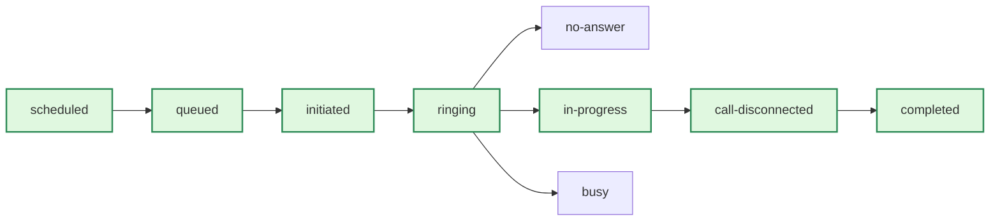

> ## Documentation Index
> Fetch the complete documentation index at: https://www.bolna.ai/docs/llms.txt
> Use this file to discover all available pages before exploring further.

# List of Call Statuses in Bolna Voice AI

> Understand every call status in Bolna Voice AI, from queued to completed. Track successful, unanswered, and failed call states.

## Introduction

Every Bolna Voice AI conversation carries two key fields throughout its lifecycle:

| Field           | Purpose                                        |
| --------------- | ---------------------------------------------- |
| `status`        | Real-time status of the conversation           |
| `error_message` | Explanatory message for errors or failed calls |

***

## Anatomy of a Call

The following diagram shows how a call progresses from initiation to completion:



<Note>
  `completed` is the **final** status of every conversation, indicating all post-call processing (recordings, data extraction) is finished.
</Note>

***

## Call Status Reference

<Tabs>
  <Tab title="Successful">
    These statuses appear in chronological order during a normal call flow:

    | Status              | Description                                                                                                                          |
    | ------------------- | ------------------------------------------------------------------------------------------------------------------------------------ |
    | `scheduled`         | Waiting for its `scheduled_at` time to elapse before being queued                                                                    |
    | `queued`            | Call received by Bolna and queued for processing                                                                                     |
    | `rescheduled`       | Call triggered outside allowed hours and automatically rescheduled (requires [call guardrails](/docs/agent-setup/call-tab) configuration) |
    | `initiated`         | Call initiated from Bolna's servers                                                                                                  |
    | `ringing`           | Call is ringing at the destination                                                                                                   |
    | `in-progress`       | Call answered and conversation is active                                                                                             |
    | `call-disconnected` | Call has been disconnected                                                                                                           |
    | `completed`         | All post-call processing finished (recordings, data extraction; may take \~2-3 minutes after disconnect)                             |
  </Tab>

  <Tab title="Unanswered">
    | Status        | Description                                     |
    | ------------- | ----------------------------------------------- |
    | `balance-low` | Insufficient Bolna balance to initiate the call |
    | `busy`        | Callee was busy                                 |
    | `no-answer`   | Phone rang but callee did not answer            |
  </Tab>

  <Tab title="Unsuccessful">
    | Status     | Description                                                   |
    | ---------- | ------------------------------------------------------------- |
    | `canceled` | Call was canceled                                             |
    | `failed`   | Call failed to connect                                        |
    | `stopped`  | Call stopped by user or due to no telephony provider response |
    | `error`    | An error occurred while placing the call                      |
  </Tab>
</Tabs>

<Info>
  The payloads for all status events follow the same structure as the [Get Execution API](/docs/api-reference/executions/get_execution) response.
</Info>

***

## Example Payload

<Accordion title="Completed call payload with &#x22;status&#x22; and &#x22;error_message&#x22;">
  ```json {7, 8} theme={"system"}
  {
    "id": 7432382142914,
    "agent_id": "3c90c3cc-0d44-4b50-8888-8dd25736052a",
    "batch_id": "d12abbbe-d16d-4c51-b18c-c7d5c3807962",
    "conversation_duration": 123,
    "total_cost": 123,
    "status": "completed",
    "error_message": null,
    "answered_by_voice_mail": true,
    "transcript": "<string>",
    "created_at": "2024-01-23T01:14:37Z",
    "updated_at": "2024-01-29T18:31:22Z",
    "usage_breakdown": {
      "synthesizer_characters": 123,
      "synthesizer_model": "polly",
      "transcriber_duration": 123,
      "transcriber_model": "deepgram",
      "llm_tokens": 123,
      "llm_model": {
        "gpt-3.5-turbo-16k": {
          "output": 28,
          "input": 1826
        },
        "gpt-3.5-standard-8k": {
          "output": 20,
          "input": 1234
        }
      }
    },
    "telephony_data": {
      "duration": 42,
      "to_number": "+10123456789",
      "from_number": "+1987654007",
      "recording_url": "https://bolna-call-recordings.s3.us-east-1.amazonaws.com/...",
      "hosted_telephony": true,
      "provider_call_id": "CA42fb13614bfcfeccd94cf33befe14s2f",
      "call_type": "outbound",
      "provider": "twilio",
      "ring_duration": 17,
      "post_dial_delay": 1,
      "to_number_carrier": "Reliance Jio Infocomm Ltd (RJIL)"
    },
    "transfer_call_data": {
      "provider_call_id": "CA42fb13614bfcfeccd94cf33befe14s2f",
      "status": "completed",
      "duration": 42,
      "cost": 123,
      "to_number": "+10123456789",
      "from_number": "+1987654007",
      "recording_url": "https://bolna-call-recordings.s3.us-east-1.amazonaws.com/...",
      "hangup_by": "Caller",
      "hangup_reason": "Normal Hangup"
    },
    "batch_run_details": {
      "status": "completed",
      "created_at": "2024-01-23T01:14:37Z",
      "updated_at": "2024-01-29T18:31:22Z",
      "retried": 0
    },
    "extracted_data": {
      "user_interested": true,
      "callback_user": false,
      "address": "42 world lane",
      "salary_expected": "42 bitcoins"
    },
    "context_details": {},
    "extraction_webhook_status": true
  }
  ```
</Accordion>

***

## Related Pages

<CardGroup cols={3}>
  <Card title="Hangup Status Codes" icon="phone-xmark" href="/docs/guides/post-call/list-phone-call-hangup-status">
    Understand who ended the call and why
  </Card>

  <Card title="Call Latency Metrics" icon="chart-bar" href="/docs/concepts/call-latencies">
    Analyze performance across the voice pipeline
  </Card>

  <Card title="Get Execution API" icon="code" href="/docs/api-reference/executions/get_execution">
    Retrieve full execution details programmatically
  </Card>
</CardGroup>
