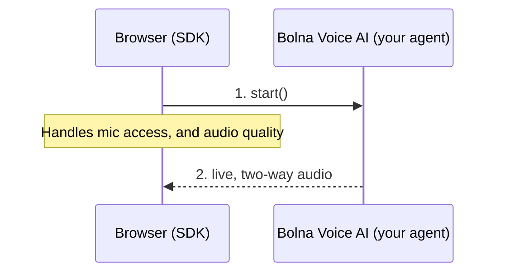
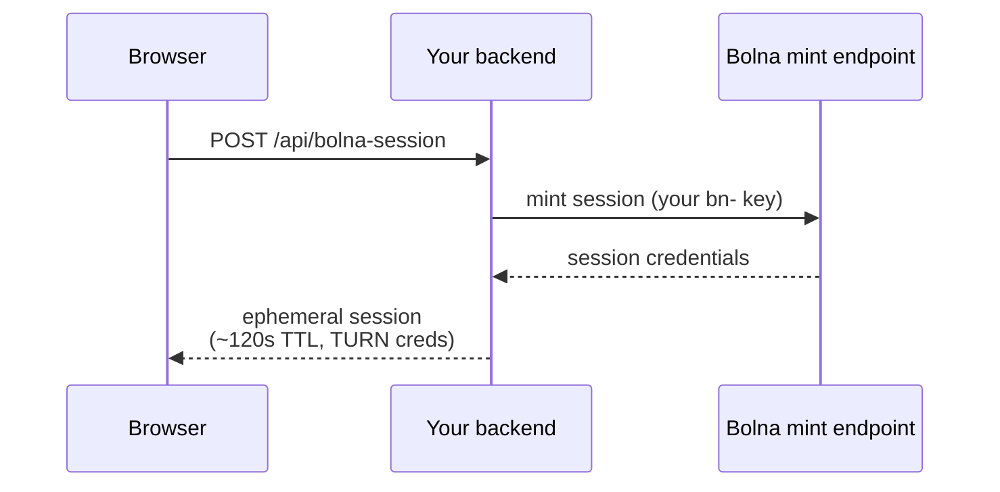
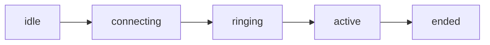

> ## Documentation Index
> Fetch the complete documentation index at: https://www.bolna.ai/docs/llms.txt
> Use this file to discover all available pages before exploring further.

# Web Call SDK

> Drop live, spoken conversations with a Bolna voice agent into any web page. One class, six events, no telephony expertise required.

<Info>
  `@bolna/web-call` · **v3.0.0** · Source: [github.com/bolna-ai/web-call](https://github.com/bolna-ai/web-call)
</Info>

<Note>
  In beta and available for any account on request. Reach out on [Slack](https://join.slack.com/t/bolnabuilders/shared_invite/zt-42zi57jyd-3yt1XDWq3kWBLj1puqq2fQ) or email [support@bolna.dev](mailto:support@bolna.dev) to have it enabled.
</Note>

## Overview

The Web Call SDK connects a browser tab directly to a Bolna voice agent for a live, two-way conversation. You render your own UI, and the SDK handles everything else: asking for mic access, connecting the call, and cleaning up when it ends.

You get a small state machine, six events, and a handful of methods. No telephony or real-time-audio background required.



## Install

<CodeGroup>
  ```bash npm theme={"system"}
  npm install @bolna/web-call
  ```

  ```javascript import theme={"system"}
  import { BolnaWebCall } from "@bolna/web-call";
  ```
</CodeGroup>

**CDN / plain `<script>`.** No bundler needed. This exposes `window.BolnaWebCall`:

```html theme={"system"}
<script src="https://cdn.jsdelivr.net/gh/bolna-ai/web-call@v3.0.0/dist/bolna-web-call.min.js"></script>
<script>
  const call = new BolnaWebCall({ sessionUrl: "/api/bolna-session" });
</script>
```

## Set up your backend

The browser side of this SDK never sees your Bolna API key (the `bn-…` key). Anyone reading your page source could lift a key that's exposed client-side and place calls on your account, so the SDK is built so that key never has a reason to be there.

Instead, the browser requests a **short-lived, single-use call session** from your own backend: a set of connection credentials that expire in roughly 120 seconds and are consumed the moment the first call uses them.



Your backend route is a thin proxy. It calls Bolna's session-mint endpoint with your key server-side, then returns the JSON unchanged:

```javascript Node/Express theme={"system"}
// put YOUR auth in front of this route
app.use(express.json());

app.post("/api/bolna-session", async (req, res) => {
  // illustrative URL: swap in your actual Bolna session-mint endpoint
  const r = await fetch("https://api.bolna.ai/v1/web-call/session", {
    method: "POST",
    headers: {
      Authorization: `Bearer ${process.env.BOLNA_API_KEY}`,
      "Content-Type": "application/json",
    },
    body: JSON.stringify({
      agent_id: process.env.BOLNA_AGENT_ID,
      user_data: req.body.user_data, // forwarded from the browser's userData
    }),
  });
  res.status(r.status).json(await r.json());
});
```

<Note>
  In `sessionUrl` mode, the SDK POSTs `{ "user_data": {...} }` to this route automatically whenever you set `userData`. Your route must forward it to Bolna's mint endpoint, like above — if it doesn't, `userData` is silently dropped and never reaches the agent.
</Note>

<Note>
  **Why there's no `apiKey` option:** the SDK deliberately can't take a Bolna API key. A minted session expires in about 2 minutes, and its credential is consumed by the first call, so leaking one buys an attacker almost nothing.
</Note>

## Quickstart

Once your backend exposes a session-minting route, the browser side comes down to three steps: create the call, listen for the events you care about, and start it from a click handler.

```javascript theme={"system"}
import { BolnaWebCall } from "@bolna/web-call";

const call = new BolnaWebCall({ sessionUrl: "/api/bolna-session" });

call.on("call-start", () => console.log("agent connected"));
call.on("call-end", ({ reason }) => console.log("ended:", reason));
call.on("error", (e) => console.error(e.code, e.message));

// must run from a user gesture (click handler): browsers block autoplay otherwise
button.onclick = () => call.start();
```

## Passing user data

Just like telephony's [`/call`](/docs/api-reference/calls/make) endpoint, you can pass per-call `userData` that gets substituted into the agent's prompt and welcome message — a `{name}` or `{order_id}` in your prompt becomes the caller's actual name or order number for that call.

Set it once in the constructor to apply it to every call from that instance, or pass it to `start()` to set or override it for a single call:

```javascript theme={"system"}
// applies to every call from this instance
const call = new BolnaWebCall({
  sessionUrl: "/api/bolna-session",
  userData: { name: "Asha", order_id: "ORD-4521" },
});

// or set/override it for just this call
call.start({ userData: { name: "Asha", order_id: "ORD-4521" } });
```

<Warning>
  **How `userData` reaches the agent depends on your session source:**

  * **`sessionUrl`** — the SDK POSTs `{ "user_data": {...} }` to your session endpoint automatically. Your backend route must forward that field to Bolna's mint endpoint unchanged (see the note under [Set up your backend](#set-up-your-backend)) or the variables are silently dropped.
  * **`getSession` / `session`** — the SDK has no request of its own to inject `userData` into. You own the mint call, so you must include `user_data` in your own mint POST yourself:

  ```javascript theme={"system"}
  const call = new BolnaWebCall({
    getSession: async () => {
      const r = await fetch("/api/bolna-session", {
        method: "POST",
        headers: { "Content-Type": "application/json" },
        body: JSON.stringify({ user_data: { name: "Asha", order_id: "ORD-4521" } }),
      });
      return r.json();
    },
  });
  ```

  There's no error or warning if you skip this — the call just connects without the variables substituted.
</Warning>

<Note>
  `userData` is a JSON object, capped at 50 KB. A mint request over that limit is rejected with a 400. It's stored on the call record and shown in call history, so don't put secrets in it.
</Note>

## Starter templates

Two complete, copy-pasteable starting points. Pick whichever matches your stack.

**Next.js (App Router).** Works out of the box on Vercel. Set `BOLNA_API_KEY` and `BOLNA_AGENT_ID` as environment variables and deploy.

```javascript app/api/bolna-session/route.js theme={"system"}
export async function POST(req) {
  const { user_data } = await req.json().catch(() => ({}));
  // illustrative URL: swap in your actual Bolna session-mint endpoint
  const r = await fetch("https://api.bolna.ai/v1/web-call/session", {
    method: "POST",
    headers: {
      Authorization: `Bearer ${process.env.BOLNA_API_KEY}`,
      "Content-Type": "application/json",
    },
    body: JSON.stringify({ agent_id: process.env.BOLNA_AGENT_ID, user_data }),
  });
  return new Response(await r.text(), {
    status: r.status,
    headers: { "Content-Type": "application/json" },
  });
}
```

```jsx app/components/BolnaCallButton.jsx theme={"system"}
"use client";
import { useState } from "react";
import { BolnaWebCall } from "@bolna/web-call";

// pass userData to fill {name}/{order_id}-style variables in the agent's prompt
export default function BolnaCallButton({ userData }) {
  const [state, setState] = useState("idle");

  const startCall = () => {
    const call = new BolnaWebCall({ sessionUrl: "/api/bolna-session", userData });
    call.on("state-change", setState);
    call.on("call-end", () => setState("idle"));
    call.on("error", (e) => console.error(e.code, e.message));
    call.start();
  };

  return (
    <button onClick={startCall} disabled={state !== "idle" && state !== "ended"}>
      {state === "active" ? "On call" : "Start call"}
    </button>
  );
}
```

```jsx usage theme={"system"}
<BolnaCallButton userData={{ name: "Asha", order_id: "ORD-4521" }} />
```

**Plain HTML + Node (no build step, no framework).** Two files, no `package.json` needed. Run `BOLNA_API_KEY=bn-… BOLNA_AGENT_ID=… node server.mjs`, then open `index.html`.

```javascript server.mjs theme={"system"}
// the .mjs extension runs as ESM with zero setup, even with no package.json
import http from "node:http";

http.createServer(async (req, res) => {
  if (req.method !== "POST" || req.url !== "/bolna-session") return res.writeHead(404).end();
  const chunks = [];
  for await (const chunk of req) chunks.push(chunk);
  const { user_data } = JSON.parse(Buffer.concat(chunks).toString() || "{}");
  // illustrative URL: swap in your actual Bolna session-mint endpoint
  const r = await fetch("https://api.bolna.ai/v1/web-call/session", {
    method: "POST",
    headers: {
      Authorization: `Bearer ${process.env.BOLNA_API_KEY}`,
      "Content-Type": "application/json",
    },
    body: JSON.stringify({ agent_id: process.env.BOLNA_AGENT_ID, user_data }),
  });
  res.writeHead(r.status, { "Content-Type": "application/json" }).end(await r.text());
}).listen(8787, () => console.log("session endpoint on http://localhost:8787/bolna-session"));
```

```html index.html theme={"system"}
<script src="https://cdn.jsdelivr.net/gh/bolna-ai/web-call@v3.0.0/dist/bolna-web-call.min.js"></script>
<button id="call">Start call</button>
<script>
  const call = new BolnaWebCall({
    sessionUrl: "http://localhost:8787/bolna-session",
    userData: { name: "Asha", order_id: "ORD-4521" },
  });
  call.on("error", (e) => alert(e.message));
  document.getElementById("call").onclick = () => call.start();
</script>
```

## API reference

**`new BolnaWebCall(options)`.** Provide **exactly one** session source. The constructor throws if you pass zero or more than one.

| Option       | Type                     | Use when                                                                                                                                     |
| ------------ | ------------------------ | -------------------------------------------------------------------------------------------------------------------------------------------- |
| `sessionUrl` | `string`                 | You have a backend route (POST, body is `{}` or `{ user_data }` when `userData` is set) returning the mint JSON. This is the standard setup. |
| `getSession` | `() => Promise<Session>` | You need custom fetch logic: extra auth headers, retries, a framework's HTTP client.                                                         |
| `session`    | `Session`                | You already have a freshly-minted session in hand. It expires in \~120s and is single-use.                                                   |

Optional, on top of one of the three above:

| Option               | Default                        | Purpose                                                                                                                                                        |
| -------------------- | ------------------------------ | -------------------------------------------------------------------------------------------------------------------------------------------------------------- |
| `userData`           | none                           | Per-call variables substituted into the agent's prompt and welcome message, identical to telephony's `user_data`. See [Passing user data](#passing-user-data). |
| `audio`              | AEC / NS / AGC on              | `MediaTrackConstraints` for the microphone.                                                                                                                    |
| `iceTransportPolicy` | `"all"`                        | `"relay"` forces TURN. Useful for testing on known-restrictive networks.                                                                                       |
| `audioElement`       | hidden element created for you | Play the agent's audio through an `<audio>` element you control.                                                                                               |
| `debug`              | `false`                        | Verbose console logging of state transitions.                                                                                                                  |

**Methods**

| Method                    | Description                                                                                                                                                                                                                                            |
| ------------------------- | ------------------------------------------------------------------------------------------------------------------------------------------------------------------------------------------------------------------------------------------------------ |
| `await call.start(opts?)` | Mints a session, requests mic permission, connects. Pass `{ userData }` to set or override per-call variables for just this call. Resolves once the agent answers. Call it from a user gesture (a click handler) so the browser allows audio playback. |
| `await call.stop()`       | Hangs up and releases the microphone, audio element, and connection watchers. Safe to call from any state.                                                                                                                                             |
| `call.setMuted(bool)`     | Toggles the local mic track without ending the call.                                                                                                                                                                                                   |
| `call.isMuted()`          | Returns the current mute state.                                                                                                                                                                                                                        |
| `call.getState()`         | Returns the current `CallState` (see below), the same value `state-change` just emitted.                                                                                                                                                               |
| `call.getRunId()`         | The call's execution id, set once `start()` mints a session. Matches the id in your Bolna call history and webhooks.                                                                                                                                   |

**Call state**



A fresh `start()` is allowed again once state reaches `ended`. Each call gets its own freshly-minted session.

**Events.** Subscribe with `call.on(event, handler)`, and remove a handler with `off` or `once` for a one-time listener.

| Event              | Payload                             | Fires when                                                                                  |
| ------------------ | ----------------------------------- | ------------------------------------------------------------------------------------------- |
| `state-change`     | `CallState`                         | Any transition between the five states above.                                               |
| `media-permission` | none                                | The browser granted microphone access.                                                      |
| `call-start`       | none                                | The agent answered. Audio is flowing both ways.                                             |
| `call-end`         | `{ reason }`                        | `"local-hangup"`, `"remote-hangup"`, or `"failed"`.                                         |
| `error`            | `{ code, message, scope?, cause? }` | See the error table below.                                                                  |
| `volume-level`     | `number` (0 to 1)                   | Agent audio level, about 10 times a second while active. Use it to drive a meter or avatar. |

<Note>
  A handler that throws is caught internally and logged. It can't take down call handling or other listeners.
</Note>

<Note>
  `cause` holds the underlying error when one exists, for example a `DOMException` from a denied `getUserMedia()` call, or the raw error from a failed `fetch()`. It's for logging and debugging: untyped (`unknown`), and not guaranteed to be present.
</Note>

**Error codes**

| Code                | Meaning                                                                             | Typical handling                                 |
| ------------------- | ----------------------------------------------------------------------------------- | ------------------------------------------------ |
| `mint_failed`       | Your session endpoint errored or returned an unexpected shape.                      | Check your backend route and network tab.        |
| `at_capacity`       | Concurrent-call limit hit. `scope` is `"global"`, `"customer"`, or `"not_enabled"`. | Show "all lines busy, try again shortly."        |
| `microphone_denied` | The user blocked microphone access.                                                 | Show mic-permission help for their browser.      |
| `connect_failed`    | Network or server unreachable, or the call setup timed out (30s).                   | Retry with a fresh `start()`.                    |
| `call_rejected`     | The server declined the call before it connected.                                   | Check the agent id and session freshness.        |
| `autoplay_blocked`  | The browser blocked audio playback.                                                 | Ensure `start()` is called from a click handler. |
| `already_active`    | `start()` was called while a call was already live.                                 | One call per `BolnaWebCall` instance at a time.  |

**Session shape.** If you use `getSession` instead of `sessionUrl`, resolve to this shape. It's exactly what Bolna's mint endpoint returns, so most integrations never construct it by hand: your backend proxies the mint response as-is.

```typescript theme={"system"}
interface Session {
  run_id: string;
  agent_id: string;
  sip_username: string;
  sip_password: string;
  sip_domain: string;
  wss_url: string;
  sip_register: boolean; // internal connection flag, pass it through unchanged
  expires_in: number;    // seconds, treat as ~120s and fetch a fresh one per call
  ice_servers: RTCIceServer[];
}
```

## Using it with React

The SDK has no framework binding. Wrap it in a hook that creates one instance per component and tears it down on unmount:

```javascript theme={"system"}
import { useEffect, useRef, useState, useCallback } from "react";
import { BolnaWebCall } from "@bolna/web-call";

function useBolnaCall(sessionUrl) {
  const callRef = useRef(null);
  const [state, setState] = useState("idle");
  const [error, setError] = useState(null);

  const start = useCallback(() => {
    const call = new BolnaWebCall({ sessionUrl });
    call.on("state-change", setState);
    call.on("error", setError);
    callRef.current = call;
    return call.start();
  }, [sessionUrl]);

  const stop = useCallback(() => callRef.current?.stop(), []);

  useEffect(() => () => { callRef.current?.stop(); }, []); // hang up on unmount

  return { state, error, start, stop };
}
```

<Warning>
  Call `start()` from the `onClick` of the button that triggered it, not from inside a `useEffect`, so the browser still counts it as a user gesture.
</Warning>

## Behavior notes

* **One call at a time per instance.** A second `start()` while a call is live rejects with `already_active` instead of double-dialing.
* **Sessions are fetched inside `start()`,** per call, so the short credential TTL never has a chance to lapse. Nothing is written to `localStorage`.
* **Echo cancellation is on by default.** Leave it on; headphones give the cleanest result.
* **Closing or navigating the tab hangs up automatically** (via `pagehide`), so abandoned calls free their concurrency slot immediately instead of waiting for a server-side timeout.
* **All audio is encrypted automatically.** Nothing to configure.
* **`userData` passed to `start(opts)` takes precedence over the constructor's `userData`** for that call only; the instance-level value is unaffected and still applies to the next `start()`.

## Migrating from v1

The v1 library (`bolna-webcall-library.js`, raw WebSocket + 16kHz PCM) still works, and existing jsDelivr pins keep resolving, so nothing breaks if you don't migrate. New integrations should start on the current version:

* Standard WebRTC (Opus + jitter buffer) instead of a raw audio WebSocket.
* Ephemeral, single-use sessions instead of handling a long-lived key in the client.
* A typed event emitter and explicit `CallState` machine instead of ad hoc callbacks.

## FAQ

<AccordionGroup>
  <Accordion title="Nothing happens when I call start(). What should I check?">
    Check the `error` event first. `start()`'s promise rejects, so an unhandled rejection is a common reason it looks silent. Log `e.code` and `e.message` to see what actually failed.
  </Accordion>

  <Accordion title="Why do I get autoplay_blocked?">
    The browser only allows audio playback that originates from a user gesture. Make sure the element handler that calls `start()` is the direct result of a click, not a promise callback, timer, or effect.
  </Accordion>

  <Accordion title="Why do calls connect slowly on some networks?">
    Connection setup can be slow on networks that force every candidate through TURN over TCP/TLS. If you're testing on a restrictive network, set `iceTransportPolicy: "relay"` to confirm TURN itself works, then leave it unset (`"all"`) in production so most calls use the faster path.
  </Accordion>

  <Accordion title="Why am I seeing at_capacity during load testing?">
    This is your account's concurrent web-call limit, not a per-browser limit. Check `error.scope`: `"customer"` means your account's cap, `"global"` means Bolna's platform-wide cap.
  </Accordion>

  <Accordion title="I set userData but the agent isn't using it. Why?">
    It depends on your session source. In `sessionUrl` mode, check that your backend route actually forwards the `user_data` field from its request body to Bolna's mint endpoint — the SDK sends it, but a proxy that ignores the body will drop it silently. In `getSession`/`session` mode, the SDK never sees your mint request at all, so you must add `user_data` to that POST yourself. Either way, there's no error thrown — the call just connects without the variables substituted. See [Passing user data](#passing-user-data).
  </Accordion>
</AccordionGroup>
